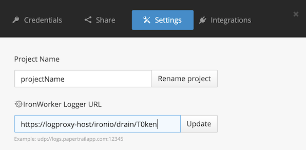

# Logproxy
[](https://dev.azure.com/philips-software/logproxy/_build/latest?definitionId=2&branchName=master)
[](https://sonarcloud.io/dashboard?id=logproxy)

A microservice which acts as a logdrain and forwards messages to HSDP Foundation logging. Supports the new HSDP v2 single tenant solution.

# Features
- Cloud foundry logdrain endpoint
- IronIO project logging endpoint 
- Batch uploads messages (max 25) for good performance
- Very lean, runs in just 32MB RAM
- [Plugin support](https://github.com/philips-software/logproxy-plugins/)
- Filter only mode
- OpenTracing support

# Distribution
Logproxy is distributed as a [Docker image](https://hub.docker.com/r/philipssoftware/logproxy):

```shell
docker pull philipssoftware/logproxy
```

# Dependencies
By default Logproxy uses RabbitMQ for log buffering. This is useful for handlingspikes in log volume. You can also choose to use an internal Go `channel` based queue.

# Environment variables

| Variable                  | Description                          | Required            | Default |
|---------------------------|--------------------------------------|---------------------|---------|
| TOKEN                     | Token to use as part of logdrain URL | Yes                 |         |
| HSDP\_LOGINGESTOR\_KEY    | HSDP logging service Key             | Yes (hsdp delivery) |         |
| HSDP\_LOGINGESTOR\_SECRET | HSDP logging service Secret          | Yes (hsdp delivery) |         |
| HSDP\_LOGINGESTOR\_URL    | HSPD logging service endpoint        | Yes (hsdp delivery) |         |
| HSDP\_LOGINGESTOR\_PRODUCT\_KEY | Product key for v2 logging     | Yes (hsdp delivery) |         |
| LOGPROXY\_SYSLOG          | Enable or disable Syslog drain       |  No                 | true    |
| LOGPROXY\_IRONIO          | Enable or disable IronIO drain       |  No                 | false   |
| LOGPROXY\_QUEUE           | Use specific queue (rabbitmq, channel) | No                | rabbitmq |
| LOGPROXY\_PLUGINDIR       | Search for plugins in this directory | No                  |         |
| LOGPROXY\_DELIVERY        | Select delivery type (hsdp, none)    | No                  | hsdp    |
| LOGPROXY\_TRANSPORT\_URL  | The Jaeager transport endpoint       | No                  |         |

# Building

## Requirements

- [Go 1.16 or newer](https://golang.org/doc/install)

## Compiling

Clone the repo somewhere (preferably outside your GOPATH):

```
$ git clone https://github.com/philips-software/logproxy.git
$ cd logproxy
$ docker build .
```

# Installation
See the below manifest.yml file as an example.

```
applications:
- name: logproxy
  domain: your-domain.com
  docker:
    image: philipssoftware/logproxy:latest
  instances: 2
  memory: 64M
  disk_quota: 512M
  routes:
  - route: logproxy.your-domain.com
  env:
    HSDP_LOGINGESTOR_KEY: SomeKey
    HSDP_LOGINGESTOR_SECRET: SomeSecret
    HSDP_LOGINGESTOR_URL: https://logingestor-int2.us-east.philips-healthsuite.com
    HSDP_LOGINGESTOR_PRODUCT_KEY: product-uuid-here
    TOKEN: RandomTokenHere
  services:
  - rabbitmq
  stack: cflinuxfs3
```

Push your application:

```
cf push
```

If everything went OK logproxy should now be reachable on https://logproxy.your-domain.com . The logdrain endpoint would then be:

```
https://logproxy.your-domain.com/syslog/drain/RandomTokenHere
```

# Configure logdrains

## Syslog
In each space where you have apps running for which you'd like to drain logs define a user defined service called `logproxy`:

```
cf cups logproxy -l https://logproxy.your-domain.com/syslog/drain/RandomTokenHere
```  

Then, bind this service to any app which should deliver their logs:

```
cf bind-service some-app logproxy
```

and restart the app to activate the logdrain:

```
cf restart some-app
```

Logs should now start flowing from your app all the way to HSDP logging infra through logproxy. You can use Kibana for log searching.

### Structured logs
Logproxy supports parsing a structured JSON log format it then maps to a HSDP LogEvent Resource. Example structured log:

```json
{
  "app": "myappname",
  "val": {
    "message": "The actual log message body"
  },
  "ver": "1.0.0",
  "evt": "EventID",
  "sev": "INFO",
  "cmp": "ComponentID",
  "trns": "transactionID",
  "usr": "someUserUUID",
  "srv": "some.host.com",
  "service": "service-name-here",
  "inst": "service-instance-id-hee",
  "cat": "Tracelog",
  "time": "2018-09-07T15:39:21Z",
  "custom": {
  		"key1": "val1",
  		"key2": { "innerkey": "innervalue" }
   }
}
```

Below is an example of an HSDP LogEvent resource type for reference

```json
{
  "resourceType": "LogEvent",
  "id": "7f4c85a8-e472-479f-b772-2916353d02a4",
  "applicationName": "OPS",
  "eventId": "110114",
  "category": "TRACELOG",
  "component": "TEST",
  "transactionId": "2abd7355-cbdd-43e1-b32a-43ec19cd98f0",
  "serviceName": "OPS",
  "applicationInstance": "INST‐00002",
  "applicationVersion": "1.0.0",
  "originatingUser": "SomeUsr",
  "serverName": "ops-dev.apps.internal",
  "logTime": "2017-01-31T08:00:00Z",
  "severity": "INFO",
  "logData": {
    "message": "Test message"
  },
  "custom": {
  		"key1": "val1",
  		"key2": { "innerkey": "innervalue" }
   }
}
```
### Mapping to LogEvent
The structured log to LogEvent mapping is done as follows

| structured field | LogEvent field     |
|------------------|--------------------|
| app              | applicationName    |
| val.message      | logData.message    |
| custom           | custom             |
| ver              | applicationVersion |
| evt              | eventId            |
| sev              | severity           |
| cmp              | component          |
| trns             | transactionId      |
| usr              | originatingUser    |
| srv              | serverName         |
| service          | serviceName        |
| inst             | applicationInstance|
| cat              | category           |
| time             | logTime            |
| trace            | traceId            |
| span             | spanId             |

## IronIO

The IronIO logdrain is available on this endpoint: `/ironio/drain/:token`

You can configure via the iron.io settings screen of your project:



### Field Mapping
Logproxy maps the IronIO field to Syslog fields as follows


| IronIO field      | Syslog field        | LogEvent field      |
|-------------------|---------------------|---------------------|
| task\_id          | ProcID              | applicationInstance |
| code\_name        | AppName             | applicationName     |
| project\_id       | Hostname            | serverName          |
| message           | Message             | logData.message     |

# Filter only mode
You may choose to operate Logproxy in Filter only mode. It will listen 
for messages on the logdrain endpoints, run these through any active
filter plugins and then discard instead of delivering them to HSDP logging.
This is useful if you are using plugins for real-time processing only.
To enable filter only mode set `LOGPROXY_DELIVERY` to `none`

```
...
env:
  LOGPROXY_DELIVERY: none
...
```

See the [Logproxy plugins](https://github.com/philips-software/logproxy-plugins) project for more details on plugins.

# TODO
- Better handling of HTTP 635 errors
